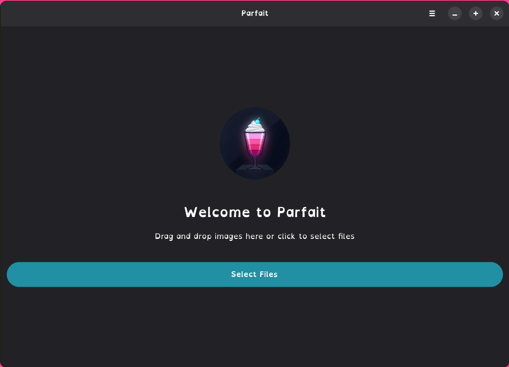
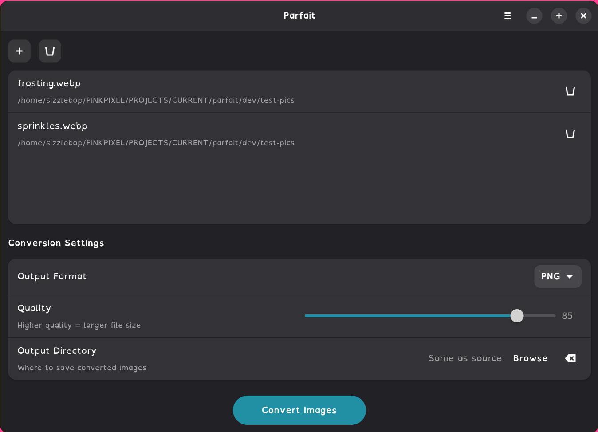
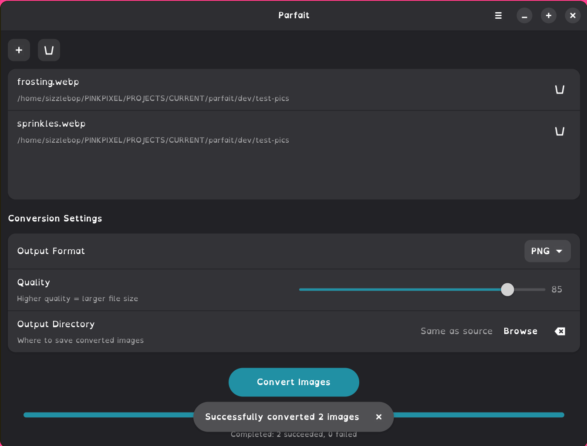

# Parfait

<div align="center">
  

  **A polished GTK4 image converter for Linux**

  [](LICENSE)
  [](https://gtk.org)
  [](https://pinkpixel.dev)
</div>

Parfait keeps the same Rust + GTK4 + Libadwaita foundation this project already had, but now ships with the new `Parfait` app name, `dev.pinkpixel.Parfait` app ID, refreshed Flatpak icons regenerated from the corrected transparent [`logo.png`](logo.png), and a working AppImage release path alongside the repository Flatpak manifest.

## ✨ Highlights

- Convert PNG, JPEG, WebP, AVIF, GIF, BMP, TIFF, and ICO images
- Batch-process multiple files with threaded background conversion
- Choose quality levels and output formats from a clean Libadwaita UI
- Pick a custom output folder or save beside the original files
- Ship with a simple downloadable AppImage and a source-build Flatpak option

## 🖼️ Screenshots

<div align="center">
  
  <br><br>
  
  <br><br>
  
</div>

## 📦 Installation

### AppImage

The easiest way to install Parfait is the downloadable AppImage.

1. Download `Parfait.AppImage` from the latest GitHub release.
2. Make it executable:

```bash
chmod +x Parfait.AppImage
```

3. Run it:

```bash
./Parfait.AppImage
```

For local packaging or rebuilding the AppImage from source:

- GitHub Releases can attach a downloadable AppImage automatically through [`linux-packages.yml`](.github/workflows/linux-packages.yml)
- Local packaging reuses the Meson install tree through [`packaging/linux/build-packages.sh`](packaging/linux/build-packages.sh)
- The AppImage is assembled with `appimagetool` from a staged AppDir plus the custom [`AppRun`](packaging/linux/AppRun)

To build the AppImage locally:

```bash
./packaging/linux/build-packages.sh appimage
```

Artifacts are written to:

```bash
dist/linux-packages/artifacts/
```

The distributable AppImage filename is:

```bash
dist/linux-packages/artifacts/Parfait.AppImage
```

The repo still keeps [`packaging/linux/nfpm.yaml`](packaging/linux/nfpm.yaml) as
future scaffolding for `.deb` and `.rpm`, but the only packaged installer path
validated in this repo right now is AppImage.

Full local packaging notes live in [`dev/LINUX-PACKAGING.md`](dev/LINUX-PACKAGING.md).

### Flatpak From Source

If you prefer a Flatpak build, clone the repo and build it locally:

```bash
git clone https://github.com/pinkpixel-dev/parfait.git
cd parfait
flatpak-builder --user --install --force-clean build-dir dev.pinkpixel.Parfait.yml
flatpak run dev.pinkpixel.Parfait
```

### Build from Source

The built application and binary are now `Parfait` / `parfait`, and the project is expected to live in the `parfait` repository.

#### Requirements

- Rust 1.75 or newer
- GTK4 4.12+
- Libadwaita 1.5+
- Meson
- NASM
- pkg-config
- `glib-compile-schemas` for staged GSettings validation
- `appimagetool` is downloaded automatically for `x86_64` AppImage builds

#### Example dependency install

```bash
# Arch Linux / CachyOS / Manjaro
sudo pacman -S rust gtk4 libadwaita meson nasm pkgconf

# Ubuntu 24.04+ / Debian Bookworm+
sudo apt install rustup libgtk-4-dev libadwaita-1-dev meson nasm pkg-config
rustup default stable

# Fedora 40+
sudo dnf install rust cargo gtk4-devel libadwaita-devel meson nasm pkg-config
```

#### Build commands

```bash
git clone https://github.com/pinkpixel-dev/parfait.git
cd parfait

# Cargo
cargo build --release
./target/release/parfait

# Meson
meson setup builddir
meson compile -C builddir
meson install -C builddir
```

## 🚀 Usage

1. Open or drag image files into the window.
2. Choose an output format and quality level.
3. Optionally pick a custom output directory.
4. Click **Convert Images** to run the batch.

### Keyboard shortcuts

| Action | Shortcut |
| --- | --- |
| Open files | `Ctrl+O` |
| Convert images | `Ctrl+Enter` |
| Clear files | `Ctrl+Shift+Delete` |
| Preferences | `Ctrl+,` |
| Shortcuts | `Ctrl+?` |
| Quit | `Ctrl+Q` |

## 🛠️ Development Notes

- Cargo package: `parfait`
- Desktop/Flatpak app ID: `dev.pinkpixel.Parfait`
- Flatpak manifest: [`dev.pinkpixel.Parfait.yml`](dev.pinkpixel.Parfait.yml)
- Flatpak manifest currently targets the remote `v1.0.0` git tag
- AppImage builder: [`packaging/linux/build-packages.sh`](packaging/linux/build-packages.sh)
- Optional future native package config: [`packaging/linux/nfpm.yaml`](packaging/linux/nfpm.yaml)
- Release workflow: [`.github/workflows/linux-packages.yml`](.github/workflows/linux-packages.yml)
- Flatpak icon sources: `logo.png` -> `data/icons/dev.pinkpixel.Parfait-{16,32,48,64,128,512}.png` and `data/icons/dev.pinkpixel.Parfait.png` for `256x256`
- Vendored cargo sources: [`parfait-cargo-sources.json`](parfait-cargo-sources.json) and [`rav1e-cargo-sources.json`](rav1e-cargo-sources.json)

## 📚 Documentation

- Technical overview: [`OVERVIEW.md`](OVERVIEW.md)
- Change log: [`CHANGELOG.md`](CHANGELOG.md)
- Roadmap: [`ROADMAP.md`](ROADMAP.md)
- Contributor guide: [`CONTRIBUTING.md`](CONTRIBUTING.md)
- Native packaging notes: [`dev/LINUX-PACKAGING.md`](dev/LINUX-PACKAGING.md)
- Release notes draft: [`dev/release-notes-v1.0.0.md`](dev/release-notes-v1.0.0.md)

## 🤝 Support

- Website: https://pinkpixel.dev
- GitHub: https://github.com/pinkpixel-dev
- Issues: https://github.com/pinkpixel-dev/parfait/issues
- Support: support@pinkpixel.dev

---

<div align="center">
  Dream it, Pixel it ✨
  <br>
  Made with 💖 by Pink Pixel
</div>
