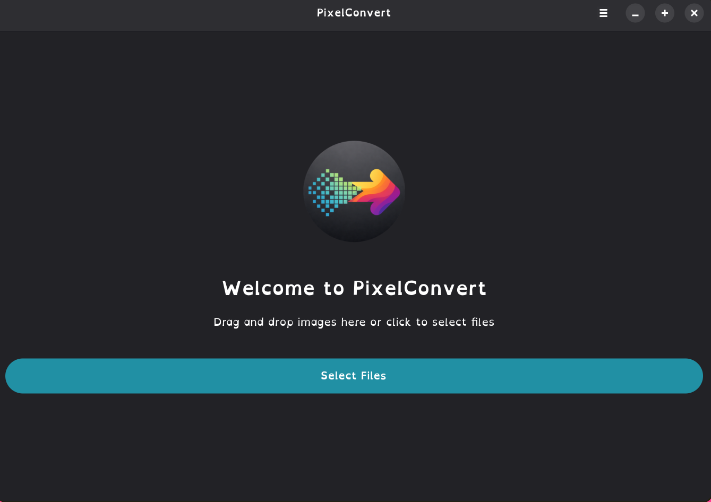
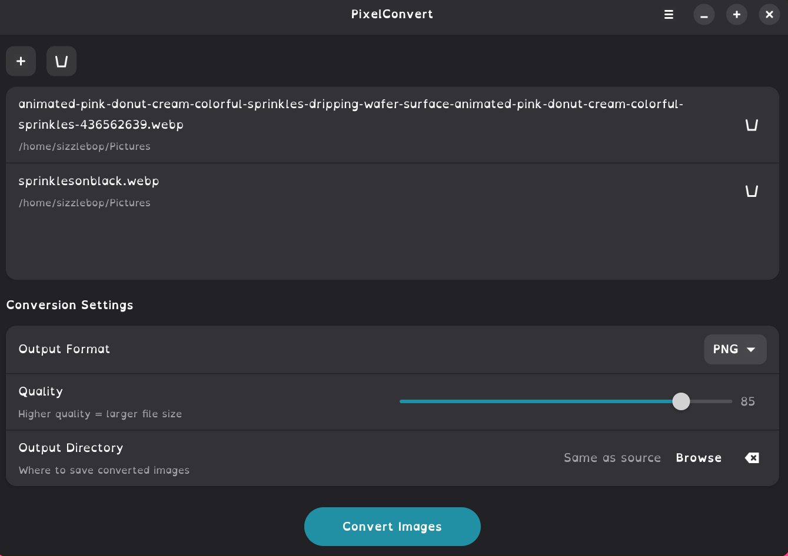

# Parfait

<div align="center">
  

  **A polished GTK4 image converter for Linux**

  [](LICENSE)
  [](https://gtk.org)
  [](https://pinkpixel.dev)
</div>

Parfait keeps the same Rust + GTK4 + Libadwaita foundation this project already had, but now ships with the new `Parfait` app name, `dev.pinkpixel.Parfait` app ID, refreshed Flatpak icons derived from [`logo.png`](logo.png), and updated desktop metadata ahead of Flathub submission.

## ✨ Highlights

- Convert PNG, JPEG, WebP, AVIF, GIF, BMP, TIFF, and ICO images
- Batch-process multiple files with threaded background conversion
- Choose quality levels and output formats from a clean Libadwaita UI
- Pick a custom output folder or save beside the original files
- Launch as `Parfait` with the new Flatpak app ID `dev.pinkpixel.Parfait`

## 🖼️ Screenshots

<div align="center">
  
  <br><br>
  
</div>

## 📦 Installation

### Flatpak

Parfait is being prepared for Flathub with this app ID:

```bash
flatpak install flathub dev.pinkpixel.Parfait
```

### Build from Source

The repository path may still be `pixelconvert` until the GitHub repository itself is renamed, but the built application and binary are now `Parfait` / `parfait`.

#### Requirements

- Rust 1.75 or newer
- GTK4 4.12+
- Libadwaita 1.5+
- Meson
- NASM
- pkg-config

#### Example dependency install

```bash
# Arch Linux / CachyOS / Manjaro
sudo pacman -S rust gtk4 libadwaita meson nasm pkgconf

# Ubuntu 24.04+ / Debian Bookworm+
sudo apt install rustup libgtk-4-dev libadwaita-1-dev meson nasm pkg-config
rustup default stable

# Fedora 40+
sudo dnf install rust cargo gtk4-devel libadwaita-devel meson nasm pkg-config
```

#### Build commands

```bash
git clone https://github.com/pinkpixel-dev/pixelconvert.git
cd pixelconvert

# Cargo
cargo build --release
./target/release/parfait

# Meson
meson setup builddir
meson compile -C builddir
meson install -C builddir
```

## 🚀 Usage

1. Open or drag image files into the window.
2. Choose an output format and quality level.
3. Optionally pick a custom output directory.
4. Click **Convert Images** to run the batch.

### Keyboard shortcuts

| Action | Shortcut |
| --- | --- |
| Open files | `Ctrl+O` |
| Convert images | `Ctrl+Enter` |
| Clear files | `Ctrl+Shift+Delete` |
| Preferences | `Ctrl+,` |
| Shortcuts | `Ctrl+?` |
| Quit | `Ctrl+Q` |

## 🛠️ Development Notes

- Cargo package: `parfait`
- Desktop/Flatpak app ID: `dev.pinkpixel.Parfait`
- Flatpak manifest: [`dev.pinkpixel.Parfait.yml`](dev.pinkpixel.Parfait.yml)
- Vendored cargo sources: [`parfait-cargo-sources.json`](parfait-cargo-sources.json) and [`rav1e-cargo-sources.json`](rav1e-cargo-sources.json)

## 📚 Documentation

- Technical overview: [`OVERVIEW.md`](OVERVIEW.md)
- Change log: [`CHANGELOG.md`](CHANGELOG.md)
- Roadmap: [`ROADMAP.md`](ROADMAP.md)
- Contributor guide: [`CONTRIBUTING.md`](CONTRIBUTING.md)
- Flathub notes: [`dev/FLATHUB-SUBMISSION-GUIDE.md`](dev/FLATHUB-SUBMISSION-GUIDE.md)

## 🤝 Support

- Website: https://pinkpixel.dev
- GitHub: https://github.com/pinkpixel-dev
- Issues: https://github.com/pinkpixel-dev/pixelconvert/issues
- Support: support@pinkpixel.dev

---

<div align="center">
  Dream it, Pixel it ✨
  <br>
  Made with 💖 by Pink Pixel
</div>
